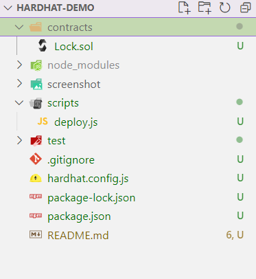

## hardhat使用教程及注意事项

### 一、搭建环境
1、使用npm命令安装hardhat到dev环境。
```
npm install --save-dev hardhat
```
2、安装常用依赖
当然你也可等到真正使用的时候再安装也不迟。
```
npm install --save-dev @nomiclabs/hardhat-waffle ethereum-waffle chai @nomiclabs/hardhat-ethers ethers
```
3、使用脚手架创建项目
```
npx hardhat
```
创建完成后，项目目录结构如下图所示。


### 二、编写合约
在Collector中编写合约文件，编写合约我们常用Openzepplin官方库，这样能大大减少代码出错的概率。我们需要使用npm
将"@openzeppelin/contracts"添加到项目中。 

这里Collector.sol合约它使用了OpenZeppelin的Solidity库和调用了Arbitrum的功能，它包含以下函数：

- 构造函数：接收一个代币合约地址作为参数，并将其保存在合约的“token”变量中。
- collect函数：接收一个地址数组、一个数量数组、一组签名数据（用于代币授权）和一个接收者地址作为参数。它首先调用IERC20接口中的approve函数，授权合约可以转移代币。然后，它通过循环遍历地址数组，对每个地址执行以下操作：
- 调用IArbitrum接口中的permit函数，授权合约可以代表该地址将指定数量的代币转移到接收者地址。
- 调用IERC20接口中的transferFrom函数，将指定数量的代币从该地址转移到接收者地址。

总体来说，这个合约可以在需要从多个地址收集代币并将它们转移到一个接收者地址的情况下使用。。

### 三、编译合约
这个步骤和其他编译形语言一样，要先编译才能部署。使用`npx hardhat compile `编译合约。

【注意】
- 译后的工件默认保存在artifacts/目录下。初次编译时是全量编译，之后如果你在上次编译后没有修改任何文件，那么什么也不会被编译。如果你只修改了一个文件，那么只有该文件和其他受其影响的文件会被重新编译。

- 如果你的合约是复制别人的，有的是0.5版本，有的是0.7，不要怕你可以在hardhat.config.js中去配置多个编译器。这意味着设置了pragma solidity ^0.5.0的文件将被solc 0.5.5编译，而一个带有pragma solidity ^0.6.0的文件将被solc 0.6.7编译。
```
hardhat-demo> npx hardhat compile 
Warning: Source file does not specify required compiler version! Consider adding "pragma solidity ^0.8.18;"
--> contracts/Collector.sol

Compiled 3 Solidity files successfully
```

### 四、部署合约
在scripts文件夹下，编写js脚本。部署合约通常由以下几种情况

- 1、合约没有构造参数，直接部署即可

- 2、合约有构造参数，需要进行传参。【注意】这里注意owner参数如何传递

- 3、要部署多个合约，合约部署有顺序上的依赖，一个合约的部署地址是另一个合约的构造参数。

脚本编写完成后，使用`npx hardhat run scripts/deploy-collector.js`

【注意】
- 为了能够成功部署solidity合约，你需要安装"@nomicfoundation/hardhat-toolbox"依赖库。如果你部署成功后，控制台将打印链上的合约地址。

### 五、本地调试
通常情况下，我们的代码要经过很多次测试才往生产环境部署，所以本地测试环境或者链接测试网就很有必要。这里我先演示如何往本地部署。

#### 1、本地启动hardhat网络

Hardhat内置了Hardhat Network，这是一个为开发而设计的本地以太坊网络。它允许你部署合约，运行测试和调试代码。
```
hardhat-demo> npx hardhat node
Started HTTP and WebSocket JSON-RPC server at http://127.0.0.1:8545/

Accounts
========

WARNING: These accounts, and their private keys, are publicly known.
Any funds sent to them on Mainnet or any other live network WILL BE LOST.

Account #0: 0xf39Fd6e51aad88F6F4ce6aB8827279cffFb92266 (10000 ETH)
Private Key: 0xac0974bec39a17e36ba4a6b4d238ff944bacb478cbed5efcae784d7bf4f2ff80

Account #1: 0x70997970C51812dc3A010C7d01b50e0d17dc79C8 (10000 ETH)
Private Key: 0x59c6995e998f97a5a0044966f0945389dc9e86dae88c7a8412f4603b6b78690d
```
通过给部署命令后面加上 --network参数就能指定部署的网络
```
hardhat-demo> npx hardhat run .\scripts\lock-deploy.js --network localhost  --show-stack-traces
Lock with 0.001ETH and unlock timestamp 1679635449 deployed to 0x5FbDB2315678afecb367f032d93F642f64180aa3
```

### 2、本地分叉主网
分叉主网是因为主网上有很多已部署好的合约。可以使用下面命令进行分叉。
```
npx hardhat node --fork https://eth-mainnet.alchemyapi.io/v2/<key>
```

### 3、本地调试合约
要调试合约我们需要两个工具，
1、在合约用引入依赖import "hardhat/console.sol";
2、在合约中使用console.log()进行打印日志
3、在test文件夹中编写你的测试脚本，并使用`npx hardhat test`进行执行测试。在执行过程中，就能打印console.log日志。

### 六、创建任务、运行任务
Hardhat是围绕task(任务)和plugins(插件)的概念设计的。每次你从CLI运行Hardhat时，你都在运行任务。 
例如 npx hardhat compile正在运行compile任务。 要查看项目中当前可用的任务，运行npx hardhat。 
通过运行npx hardhat help [task]，可以探索任何任务。

任务这个概念的引入有什么好处呢？结构逻辑更加清晰。同时编写的task可以相当于给hardhat命令行扩充功能，可扩展性非常高。

#### 6.1 创建一个任务
我们使用task函数来创建一个任务。
```
const { task } = require("hardhat/config");

const { ethers } = require("ethers");

task("create-account", "创建空白钱包")
  .addParam("amount", "钱包数量")
  .setAction(async taskArgs => {
    for(let i = 0; i < taskArgs.amount; i++){
      const wallet = ethers.Wallet.createRandom();
      console.log("%s,%s,%s", wallet.address,wallet.privateKey,wallet.mnemonic.phrase);
    }

  });

module.exports = {};
```
然后在hardhat.config.js中全局引入任务
```
require("@nomiclabs/hardhat-waffle");
require("./tasks/claimtoken");
require("./tasks/taskdemo");
```
最后使用`npx hardhat`查看
```
hardhat-demo> npx hardhat
AVAILABLE TASKS:
  approve
  balance               Prints an account's balance
  check                 Check whatever you need
  claim
  clean                 Clears the cache and deletes all artifacts
  compile               Compiles the entire project, building all artifacts
  console               Opens a hardhat console
  create-account        创建空白钱包
  flatten               Flattens and prints contracts and their dependencies. If no file is passed, all the contracts in the project will be flattened.
  help                  Prints this message
  node                  Starts a JSON-RPC server on top of Hardhat Network
  run                   Runs a user-defined script after compiling the project
  test                  Runs mocha tests
```
代码中的参数详见下图，

#### 6.2 执行任务
```
$ npx hardhat create-account --amount 10
0x75CA3816314a197A70CFd4F04d40e6215190E6b2,0x99a9b89e732ace7341e95f47f3de8aa985af0ea42370f6717d6fc02d4cd1df5c,thunder fringe budget play endless brief capable photo correct congress rookie sell
0xEC31fE7A6674e31B730a915327a7f35fdb6831b5,0xc7a46c24cdb83dc581ad032596e5e77e6ebc88a55abfbcde3d24dd0197b2a4f0,quality ugly panther own father excuse derive list blush blouse embody surface
0x8A4889B8d4bC7eeB08FF8940279666C2754cfe1E,0x20dbb5cdcf4c5084bdef3c688a962b6aa381e5d10698cf9632f369e645dbdbac,report inner labor river moment cousin genuine click flush document shed outside
0x030094Ac5080173dCA0B29dA9d289c279C069cF0,0xf091bd28e244655205736c119ff1ec7f5d11f1406a13ad4a024490963c758b40,ceiling enact return pear garage muffin grocery garbage source stomach leaf level
0x31ed941926f2e133994e8300aAA626a1b223FE70,0x64d611eef3e3568e0d7ca96124f0bcf21cf2314cbd45087258f09e3a2948f5bd,acid panda silk surge lemon evil next primary scheme apart brother learn
0xf5AAFdB79665ACB27c0bC38cC42e89e5dBe38152,0x15824652d062d90cc431cf13ced0e904d325bb8c70c14accb29b24f4b0d002f1,cotton security muscle coconut horse belt message spot pear room salad broom
0xA75D477f1cc3240Ce9Adb9927742c1E67fDC0E30,0xe47ed0c59f9ebd00546cb377371f081f59147715a988a0b5cc4e3e9804e48641,split ready talk lawn cost garment subway rather either sun athlete seed
```
